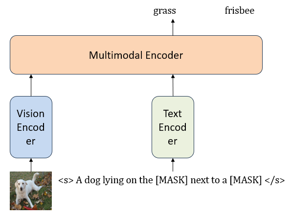
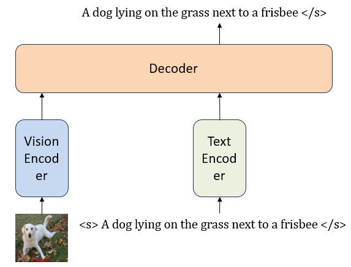
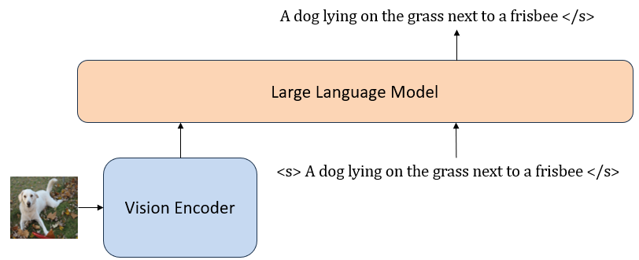

# Awesome Vision Language Pretraining Glossary

## Table of Contents
* [1. Models](#1-models)

    * [1.1 Encoder-Only Models](#11-encoder-only-models)
        * [BERT-like Pretrained Family](#bert-like-pretrained-family)

        * [Contrastive Learning Family](#contrastive-learning-family)

        * [Large-scale Representation Learning Family](#large-scale-representation-learning-family)

    * [1.2 Encoder-Decoder Models](#12-encoder-decoder-models)

        * [Medium-scale Encoder Decoder](#medium-scaled-encoder-decoder-family)

        * [Align with LLMs](#vision-signal-aligned-with-llms)

        * [Align with Human Instructions](#vlms-aligned-with-human-instructions)

        * [LLMs as General Interface](#llms-as-general-interface)

        * [PEFT VLMS](#parameter-efficient-vlms)

* [2. Tasks & Datasets](#2-tasks--datasets)

    * [2.1 Pretraining Datasets](#21-pretraining-datasets)

    * [2.2 Image Captioning Datasets](#22-image-captioning)

    * [2.3 Visual Question Answering Datasets](#23-visual-question-answering)

    * [2.4 Visual Reasoning Datasets](#24-visual-reasoning)

* [3. Surveys](#3-surveys)

* [4. Tutorials and Other Resources](#4-tutorials-and-other-resources)

## 1. Models

### 1.1 Encoder-Only Models
<!-- 

    

    
A typical encoder-only two stream VLP model

 -->

* ### BERT-like Pretrained Family

| Model Name 	| Arxiv Time  	| Paper                                     	| Code                                                               	| Resources                                                                     	|
|------------	|-------------	|-------------------------------------------	|--------------------------------------------------------------------	|-------------------------------------------------------------------------------	|
| ViLBERT    	| Aug 6 2019  	| [paper](https://arxiv.org/abs/1908.02265) 	| [official](https://github.com/facebookresearch/vilbert-multi-task) 	|                                                                               	|
| VisualBERT 	| Aug 9 2019  	| [paper](https://arxiv.org/abs/1908.03557) 	| [official](https://github.com/uclanlp/visualbert)                  	| [huggingface](https://huggingface.co/docs/transformers/model_doc/visual_bert) 	|
| LXMERT     	| Aug 20 2019 	| [paper](https://arxiv.org/abs/1908.07490) 	| [official](https://github.com/airsplay/lxmert)                     	| [huggingface](https://huggingface.co/docs/transformers/model_doc/lxmert)      	|
| VL-BERT    	| Aug 22 2019 	| [paper](https://arxiv.org/abs/1908.08530) 	| [official](https://github.com/jackroos/VL-BERT)                    	|                                                                               	|
| UNITER     	| Sep 25 2019 	| [paper](https://arxiv.org/abs/1909.11740) 	| [official](https://github.com/ChenRocks/UNITER)                    	|                                                                               	|
| PixelBERT  	| Apr 2 2020  	| [paper](https://arxiv.org/abs/2004.00849) 	|                                                                    	|                                                                               	|
| Oscar      	| Apr 4 2020  	| [paper](https://arxiv.org/abs/2004.06165) 	| [official](https://github.com/microsoft/Oscar)                     	|                                                                               	|
| VinVL      	| Jan 2 2021  	| [paper](https://arxiv.org/abs/2101.00529) 	| [official](https://github.com/pzzhang/VinVL)                       	|                                                                               	|
| ViLT       	| Feb 5 2021  	| [paper](https://arxiv.org/abs/2102.03334) 	| [official](https://github.com/dandelin/ViLT)                       	| [huggingface](https://huggingface.co/docs/transformers/model_doc/vilt)        	|
| CLIP-ViL   	| Jul 13 2021 	| [paper](https://arxiv.org/abs/2107.06383) 	| [official](https://github.com/clip-vil/CLIP-ViL)                   	|                                                                               	|
| METER      	| Nov 3 2021  	| [paper](https://arxiv.org/abs/2111.02387) 	| [official](https://github.com/zdou0830/METER)                      	|                                                                               	|

* ### Contrastive Learning Family

| Model Name 	| Arxiv Time  	| Paper                                     	| Code                                                                  	| Comment                                                                          	|
|------------	|-------------	|-------------------------------------------	|-----------------------------------------------------------------------	|----------------------------------------------------------------------------------	|
| CLIP       	| Feb 26 2021 	| [paper](https://arxiv.org/abs/2103.00020) 	| [offical](https://github.com/openai/CLIP)                             	| Powerful representation learnt through large-scale image-text contrastive pairs. 	|
| ALIGN      	| Feb 11 2021 	| [paper](https://arxiv.org/abs/2102.05918) 	|                                                                       	| Impressive image-text retrieval ability.                                         	|
| FILIP      	| Nov 9 2021  	| [paper](https://arxiv.org/abs/2111.07783) 	|                                                                       	| Finer-grained representation learnt through contrastive patches.                 	|
| LiT        	| Nov 15 2021 	| [paper](https://arxiv.org/abs/2111.07991) 	| [official](https://google-research.github.io/vision_transformer/lit/) 	| Frozen image encoders proven to be effective.                                    	|
| Florence   	| Nov 22 2021 	| [paper](https://arxiv.org/abs/2111.11432) 	|                                                                       	| Large scale contrastive pretraining and adapted to vision downstream tasks.      	|
| FLIP       	| Dec 1 2022  	| [paper](https://arxiv.org/abs/2212.00794) 	| [offical](https://github.com/facebookresearch/flip)                   	| Further scaled up negative samples by masking out 95% image patches.             	|

* ### Large-scale Representation Learning Family

| Model Name 	| Arxiv Time  	| Paper                                     	| Code                                                                                	| Comment                                                                                                                  	|
|------------	|-------------	|-------------------------------------------	|-------------------------------------------------------------------------------------	|--------------------------------------------------------------------------------------------------------------------------	|
| MDETR      	| Apr 26 2021 	| [paper](https://arxiv.org/abs/2104.12763) 	| [official](https://github.com/ashkamath/mdetr)                                      	| Impressive visual grounding abilities achieved with DETR and RoBERTa                                                     	|
| ALBEF      	| Jul 16 2021 	| [paper](https://arxiv.org/abs/2107.07651) 	| [official](https://github.com/salesforce/ALBEF)                                     	| BLIP's predecessor. Contrastive learning for unimodal representation followed by a multimodal transformer-based encoder. 	|
| UniT       	| Aug 3 2021  	| [paper](https://arxiv.org/abs/2102.10772) 	| [official](https://mmf.sh/docs/projects/unit)                                       	|                                                                                                                          	|
| VLMo       	| Nov 3 2021  	| [paper](https://arxiv.org/abs/2111.02358) 	| [official](https://github.com/microsoft/unilm/tree/master/vlmo)                     	| Mixture of unimodal experts before multimodal experts.                                                                   	|
| UFO        	| Nov 19 2021 	| [paper](https://arxiv.org/abs/2111.10023) 	|                                                                                     	|                                                                                                                          	|
| FLAVA      	| Dec 8 2021  	| [paper](https://arxiv.org/abs/2112.04482) 	| [official](https://github.com/facebookresearch/multimodal/tree/main/examples/flava) 	| Multitask training for unimodal and multimodal representations. Can be finetuned for a variety of downstream tasks.      	|
| BEiT-3     	| Aug 8 2022  	| [paper](https://arxiv.org/abs/2208.10442) 	| [official](https://github.com/microsoft/unilm/tree/master/beit3)                    	| VLMo scaled up.                                                                                                          	|

### 1.2 Encoder-Decoder Models
<!-- 

    

    
A typical encoder-decoder VLP model

 -->

* ### Medium-scaled Encoder-Decoder Family

| Model Name 	| Arxiv Time  	| Paper                                         	| Code                                                          	| Comment                                                                                                                           	|
|------------	|-------------	|-----------------------------------------------	|---------------------------------------------------------------	|-----------------------------------------------------------------------------------------------------------------------------------	|
| VL-T5      	| Feb 4 2021  	| [paper](https://arxiv.org/pdf/2102.02779.pdf) 	| [official](https://github.com/j-min/VL-T5)                    	| Unified image-text tasks with text generation, also capable of grounding.                                                         	|
| SimVLM     	| Aug 24 2021 	| [paper](https://arxiv.org/abs/2108.10904)     	| [official](https://github.com/YulongBonjour/SimVLM)           	| Pretrained with large-scale image-text pairs and image-text tasks with prefix LM.                                                 	|
| UniTab     	| Nov 23 2021 	| [paper](https://arxiv.org/abs/2111.12085)     	| [official](https://github.com/microsoft/UniTAB)               	| Unified text generation with bounding box outputs.                                                                                	|
| BLIP       	| Jan 28 2021 	| [paper](https://arxiv.org/abs/2201.12086)     	| [official](https://github.com/salesforce/BLIP)                	| Capfilt method for bootstrapping image-text pair data generation. Contrastive learning, image-text matching and LM as objectives. 	|
| CoCa       	| May 4 2022  	| [paper](https://arxiv.org/abs/2205.01917)     	| [pytorch](https://github.com/lucidrains/CoCa-pytorch)         	| Large-scale image-text contrastive learning with text generation(LM)                                                              	|
| GIT        	| May 27 2022 	| [paper](https://arxiv.org/abs/2205.14100)     	| [official](https://github.com/microsoft/GenerativeImage2Text) 	| GPT-like language model conditioned on visual features extracted by pretrained ViT. (SoTA on image captioning tasks)              	|
| DaVinci    	| Jun 15 2022 	| [paper](https://arxiv.org/abs/2206.07699)     	| [official](https://github.com/shizhediao/DaVinci)             	| Output generation conditioned on prefix texts or prefix images. Supports text and image generation.                                	|

* ### Vision Signal Aligned with LLMs(Base Models)

<!-- 

    

    
A typical multimodal large language model

 -->

| Model Name   	| Arxiv Time  	| Paper                                     	| Code                                                                            	|
|--------------	|-------------	|-------------------------------------------	|---------------------------------------------------------------------------------	|
| Frozen       	| Jun 25 2021 	| [paper](https://arxiv.org/abs/2106.13884) 	|                                                                                 	|
| Flamingo     	| Apr 29 2022 	| [paper](https://arxiv.org/abs/2204.14198) 	| [OpenFlamingo](https://github.com/mlfoundations/open_flamingo)                  	|
| MetaLM       	| Jun 13 2022 	| [paper](https://arxiv.org/abs/2206.06336) 	| [official](https://github.com/microsoft/unilm/tree/master/metalm)               	|
| PaLI         	| Sep 14 2022 	| [paper](https://arxiv.org/abs/2209.06794) 	|                                                                                 	|
| BLIP-2       	| Jan 30 2023 	| [paper](https://arxiv.org/abs/2301.12597) 	| [official](https://github.com/salesforce/LAVIS/tree/main/projects/blip2)        	|
| KOSMOS       	| Feb 27 2023 	| [paper](https://arxiv.org/abs/2302.14045) 	| [official](https://github.com/microsoft/unilm/tree/master/kosmos-1)             	|
| PaLM-E       	| Mar 6 2023  	| [paper](https://arxiv.org/abs/2303.03378) 	|                                                                                 	|

* ### VLMs Aligned with Human Instructions(SFT, Instruction Tuning)

| Model Name   	| Arxiv Time  	| Paper                                     	| Code                                                                            	|
|--------------	|-------------	|-------------------------------------------	|---------------------------------------------------------------------------------	|
| LLaVA        	| Apr 17 2023 	| [paper](https://arxiv.org/abs/2304.08485) 	| [official](https://github.com/haotian-liu/LLaVA)                                	|
| Mini-GPT4    	| Apr 20 2023 	| [paper](https://arxiv.org/abs/2304.10592) 	| [official](https://github.com/Vision-CAIR/MiniGPT-4)                            	|
| Otter        	| May 5 2023  	| [paper](https://arxiv.org/abs/2305.03726) 	| [official](https://github.com/Luodian/Otter)                                    	|
| InstructBLIP 	| May 11 2023 	| [paper](https://arxiv.org/abs/2304.10592) 	| [official](https://github.com/salesforce/LAVIS/tree/main/projects/instructblip) 	|
| VisionLLM    	| May 18 2023 	| [paper](https://arxiv.org/abs/2305.11175) 	| [official](https://github.com/OpenGVLab/VisionLLM)                              	|
| KOSMOS-2     	| Jun 26 2023 	| [paper](https://arxiv.org/abs/2306.14824) 	| [official](https://github.com/microsoft/unilm/tree/master/kosmos-2)             	|
| Emu          	| Jul 11 2023 	| [paper](https://arxiv.org/abs/2307.05222) 	| [official](https://github.com/baaivision/Emu)                                   	|

* ### Parameter-Efficient VLMs(Exploring Training Schemes)

| Model Name       	| Arxiv Time  	| Paper                                         	| Code                                                         	|
|------------------	|-------------	|-----------------------------------------------	|--------------------------------------------------------------	|
| MAGMA            	| Dec 9 2021  	| [paper](https://arxiv.org/abs/2112.05253)     	| [official](https://github.com/Aleph-Alpha/magma/tree/master) 	|
| VL-Adapter       	| Dec 13 2021 	| [paper](https://arxiv.org/abs/2112.06825)     	| [official](https://github.com/ylsung/VL_adapter)             	|
| LiMBeR           	| Sep 30 2022 	| [paper](https://arxiv.org/abs/2209.15162)     	| [official](https://github.com/jmerullo/limber)               	|
| LLaMA-Adapter    	| Mar 28 2023 	| [paper](https://arxiv.org/abs/2303.16199)     	| [official](https://github.com/OpenGVLab/LLaMA-Adapter)       	|
| LLaMA-Adapter-v2 	| Apr 28 2023 	| [paper](https://arxiv.org/abs/2304.15010)     	| [official](https://github.com/OpenGVLab/LLaMA-Adapter)       	|
| UniAdapter       	| May 21 2023 	| [paper](https://arxiv.org/pdf/2302.06605.pdf) 	| [official](https://github.com/UniAdapter/UniAdapter)         	|
| ImageBind-LLM    	| Sep 11 2023 	| [paper](https://arxiv.org/abs/2309.03905)     	| [official](https://github.com/OpenGVLab/LLaMA-Adapter)       	|

* ### LLMs as General Interface(New Frontiers in LLM Interface)

| Model Name         	| Arxiv Time  	| Paper                                         	| Code                                                   	|
|--------------------	|-------------	|-----------------------------------------------	|--------------------------------------------------------	|
| Visual Programming 	| Nov 18 2022 	| [paper](https://arxiv.org/abs/2211.11559)     	| [official](https://github.com/allenai/visprog)         	|
| ViperGPT           	| Mar 14 2023 	| [paper](https://arxiv.org/abs/2303.08128)     	| [official](https://github.com/cvlab-columbia/viper)    	|
| MM-React           	| Mar 20 2023 	| [paper](https://arxiv.org/abs/2303.11381)     	| [official](https://github.com/microsoft/MM-REACT)      	|
| Chameleon          	| May 24 2023 	| [paper](https://arxiv.org/abs/2304.09842)     	| [official](https://github.com/lupantech/chameleon-llm) 	|
| HuggingGPT         	| May 25 2023 	| [paper](https://arxiv.org/abs/2303.17580)     	| [official](https://github.com/microsoft/JARVIS)        	|
| IdealGPT           	| May 24 2023 	| [paper](https://arxiv.org/abs/2305.14985)     	| [official](https://github.com/Hxyou/IdealGPT)          	|
| NextGPT            	| Sep 13 2023 	| [paper](https://arxiv.org/pdf/2309.05519.pdf) 	|                                                        	|

## 2. Tasks & Datasets

### 2.1 Pretraining Datasets

| Dataset              	| Time 	| Size  	| Format           	| Task                         	| Link                                                           	|
|----------------------	|------	|-------	|------------------	|------------------------------	|----------------------------------------------------------------	|
| SBU Captions         	| 2011 	| 1M    	| image-text pairs 	| pretraining/image captioning 	| https://vislang.ai/sbu-explorer                                	|
| YFCC-100M            	| 2015 	| 100M  	| image-text pairs 	| pretraining                  	| https://multimediacommons.wordpress.com/yfcc100m-core-dataset/ 	|
| CC3M                 	| 2018 	| 3M    	| image-text pairs 	| pretraining/image captioning 	| https://github.com/google-research-datasets/conceptual-12m     	|
| LAIT                 	| 2020 	| 10M   	| image-text pairs 	| pretraining                  	|                                                                	|
| Localized Narratives 	| 2020 	| 849K  	| image-text pairs 	| pretraining                  	| https://google.github.io/localized-narratives/                 	|
| CC12M                	| 2021 	| 12M   	| image-text pairs 	| pretraining                  	| https://github.com/google-research-datasets/conceptual-12m     	|
| LAION-400M           	| 2021 	| 400M  	| image-text pairs 	| pretraining                  	| https://laion.ai/laion-400-open-dataset/                       	|
| RedCaps              	| 2021 	| 12M   	| image-text pairs 	| pretraining                  	| https://redcaps.xyz/                                           	|
| WIT                  	| 2021 	| 37.5M 	| image-text pairs 	| pretraining                  	| https://github.com/google-research-datasets/wit                	|
| LAION-5B             	| 2022 	| 5B    	| image-text pairs 	| pretraining                  	| https://laion.ai/blog/laion-5b/                                	|

### 2.2 Image Captioning

| Dataset   	| Time 	| Size 	| Format                      	| Task             	| Link                                       	|
|-----------	|------	|------	|-----------------------------	|------------------	|--------------------------------------------	|
| Flickr30k 	| 2014 	| 30K  	| image-text pairs            	| image captioning 	| https://arxiv.org/abs/1505.04870           	|
| COCO      	| 2014 	| 567K 	| image-text pairs            	| image captioning 	| https://cocodataset.org/#home              	|
| TextCaps  	| 2020 	| 28K  	| image-text pairs            	| image captioning 	| https://textvqa.org/textcaps/              	|
| VizWiz    	| 2020 	| 20K  	| image-question-answer pairs 	| VQA              	| https://vizwiz.org/tasks-and-datasets/vqa/ 	|

### 2.3 Visual Question Answering

| Dataset       	| Time 	| Size 	| Format                                           	| Task            	| Link                                                            	|
|---------------	|------	|------	|--------------------------------------------------	|-----------------	|-----------------------------------------------------------------	|
| Visual Genome 	| 2017 	| 108K 	| image-question-answer pairs, region descriptions 	| VQA/pretraining 	| https://homes.cs.washington.edu/~ranjay/visualgenome/index.html 	|
| VQA v2        	| 2017 	| 1.1M 	| question-answer pairs                            	| VQA             	| https://visualqa.org/                                           	|
| TextVQA       	| 2019 	| 28K  	| image-question-answer pairs                      	| VQA             	| https://textvqa.org/                                            	|
| OCR-VQA       	| 2019 	| 1M   	| image-question-answer pairs                      	| VQA             	| https://ocr-vqa.github.io/                                      	|
| ST-VQA        	| 2019 	| 31K  	| image-question-answer pairs                      	| VQA             	| https://arxiv.org/abs/1905.13648                                	|
| OK-VQA        	| 2019 	| 14K  	| image-question-answer pairs                      	| VQA             	| https://okvqa.allenai.org/                                      	|
| VizWiz        	| 2020 	| 20K  	| image-question-answer pairs                      	| VQA             	| https://vizwiz.org/tasks-and-datasets/vqa/                      	|
| IconQA        	| 2021 	| 107K 	| image-question-answer pairs                      	| VQA             	| https://iconqa.github.io/                                       	|
| ScienceQA     	| 2022 	| 21K  	| image-question-answer pairs                      	| VQA             	| https://github.com/lupantech/ScienceQA                          	|

### 2.4 Visual Reasoning

| Dataset                      	| Time 	| Size 	| Format                      	| Task                                	| Link                                                  	|
|------------------------------	|------	|------	|-----------------------------	|-------------------------------------	|-------------------------------------------------------	|
| NLVR                         	| 2017 	| 92K  	| image-grounded statements   	| reasoning                           	| https://lil.nlp.cornell.edu/nlvr/                     	|
| GQA                          	| 2019 	| 1M   	| image-text pairs            	| visual reasoning/question answering 	| https://cs.stanford.edu/people/dorarad/gqa/about.html 	|
| Visual Commonsense Reasoning 	| 2019 	| 110K 	| image-question-answer pairs 	| reasoning                           	| https://visualcommonsense.com/                        	|
| SNLI-VE                      	| 2019 	| 530K 	| image-question-answer pairs 	| reasoning                           	| https://github.com/necla-ml/SNLI-VE                   	|
| Winoground                   	| 2022 	|      	| image-text pairs            	| reasoning                           	| https://huggingface.co/datasets/facebook/winoground   	|

## 3. Surveys

* [Foundational Models Defining a New Era in Vision: A Survey and Outlook](https://arxiv.org/abs/2307.13721)

* [Vision-Language Pre-training: Basics, Recent Advances, and Future Trends](https://arxiv.org/abs/2210.09263)

* [Multimodal Foundation Models: From Specialists to General-Purpose Assistants](https://arxiv.org/abs/2309.10020)

## 4. Tutorials and Other Resources

* [Andrej Karpathy, State of GPT](https://www.youtube.com/watch?v=bZQun8Y4L2A)

* [[CVPR2023 Tutorial Talk] Large Multimodal Models: Towards Building and Surpassing Multimodal GPT-4](https://www.youtube.com/watch?v=mkI7EPD1vp8)

* [VLP Tutorial](https://vlp-tutorial.github.io/)